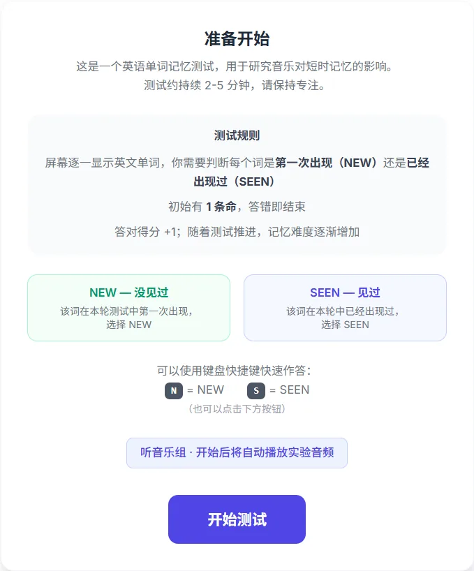

# Verbal Memory 实验平台

一个用于**研究音乐对短时记忆 / 学习效率影响**的英文单词记忆测试平台，玩法致敬 [humanbenchmark.com](https://humanbenchmark.com) 的 Verbal Memory 测试。被试在「听音乐」与「不听音乐」两种条件下完成测试，系统记录得分与完成时长。

> 自建而非直接用 humanbenchmark.com 的原因：第三方网站无法在服务端加埋点，词表与难度算法也不公开。本项目自管词表、难度曲线、音频播放与数据采集，保证两组条件可比。

<p align="center">
  
</p>

## 使用流程

1. **填写被试信息**：昵称、年龄、性别、日常听音乐习惯，并选择本次实验条件（听音乐 / 不听音乐）。每位被试建议两种条件各完成一次，多次参与沿用同一昵称，便于关联成绩。
2. **准备页**：展示测试规则与当前条件（听音乐组开始后自动循环播放实验音频）。
3. **测试**：屏幕逐一显示英文单词，判断该词是 **NEW**（本轮第一次出现）还是 **SEEN**（本轮出现过）。答对得分 +1，**答错即结束**（当前为 1 条命）。
4. **结束**：自动提交得分与用时，可返回首页重测，或查看两组各自前十名的排行榜。
5. **实验员管理**：打开 `?admin=1` 页面查看全部记录、删除异常数据、一键导出 CSV。

## 测试机制

- **生命值**：初始 1 条命，答错一次游戏结束。
- **计分**：`score` = 答对总次数。
- **键盘快捷键**：`N` = New（新词），`S` = Seen（已见）。也可点击屏幕按钮。
- **词库**：`frontend/src/data/wordlist.ts`，约 6400 个去重英文高频词（由两份专四/专八高频词表合并生成）。
- **难度曲线**：保证开头为新词，此后每轮约 40% 概率出「已见词」、60% 出新词；同一词不会紧挨着连续出现；连续 5 个新词后必定插入一个已见词。详见 `frontend/src/lib/verbalTest.ts`。

## 采集数据

| 表 | 字段 | 说明 |
|---|---|---|
| participant | code / age / gender / music_habit | 被试编号（昵称）、年龄、性别、日常听歌习惯 |
| test_record | participant_id / condition / score / duration_ms | 关联被试、条件（`no_music`/`music`）、得分、完成时长（ms） |

> ⚠️ 注意：`score` 与 `duration_ms` 高度相关——得分越高、答题轮数越多，用时自然越长。两者不是相互独立的指标，统计分析时不要当作独立变量处理。

同一被试可以多次参与（不同条件各一次），故 `participant : test_record = 1 : N`。

## 技术栈

| 层 | 选型 |
|---|---|
| 前端 | Vite 5 + React 18 + TypeScript 5 + Tailwind CSS 3 |
| 后端 | Spring Boot 3.2 + MyBatis-Plus 3.5（Java 17） |
| 数据库 | MySQL 8 |
| 音频 | HTML5 `<audio>`，Vite `import.meta.glob` 自动发现 |

## 目录结构

```
verbal_test/
├── frontend/                    # Vite + React + TS + Tailwind
│   ├── src/
│   │   ├── components/          # InfoForm / ReadyScreen / TestScreen / DoneScreen / Leaderboard / AdminPage / CustomSelect
│   │   ├── lib/
│   │   │   ├── api.ts           # 类型化的后端 HTTP 封装
│   │   │   └── verbalTest.ts    # 纯 TS 状态机（难度算法 / 命数）
│   │   ├── data/wordlist.ts     # 英文词库
│   │   └── assets/audio/        # 放音频文件即被自动发现（见下方说明）
│   └── ...
├── backend/                     # Spring Boot
│   ├── src/main/java/com/verbaltest/
│   │   ├── config/              # CORS 配置
│   │   ├── controller/          # ParticipantController / RecordController
│   │   ├── service/             # 业务逻辑
│   │   ├── mapper/              # MyBatis-Plus Mapper
│   │   ├── entity/              # Participant / TestRecord
│   │   └── dto/                 # 请求/响应 DTO + RecordView
│   ├── sql/init.sql             # 建库 + 建表
│   └── Dockerfile
├── compose.yaml                 # 生产环境 Docker Compose（后端 + MySQL）
├── deploy/README.md             # 生产部署说明
└── docs/screenshots/            # 演示截图
```

## 本地开发

### 1. 数据库

```bash
mysql -u root -p < backend/sql/init.sql
```

创建数据库 `verbal_test` 与表 `participant`、`test_record`。若 root 密码不是 `root`，通过环境变量或 `backend/src/main/resources/application.yml` 修改。

### 2. 后端

```bash
cd backend
mvn spring-boot:run        # → http://localhost:8080
```

可在 `application.yml` 中看到全部可覆盖环境变量：`DB_HOST`、`DB_PORT`、`DB_NAME`、`DB_USERNAME`、`DB_PASSWORD`、`ALLOWED_ORIGINS` 等。

### 3. 前端

```bash
cd frontend
pnpm install        # 或 npm install
pnpm dev            # → http://localhost:5173
```

- 被试入口：`http://localhost:5173/`
- 管理页：`http://localhost:5173/?admin=1`
- 后端地址在 `frontend/.env` 的 `VITE_API_BASE` 配置（默认 `http://localhost:8080`），后端 CORS 已放开。
- 构建产物：`pnpm build` → `frontend/dist/`，可直接部署到任意静态托管。

### 4. 替换实验音频

把音频文件放到 `frontend/src/assets/audio/` 即可，Vite 会在构建/dev 时自动扫描该目录并取第一个文件播放。**无需改任何配置。** 支持 MP3 / M4A / AAC / WAV / OGG / Opus / FLAC，文件名可为中文或含空格。删除旧文件、放入新文件后保存任意源文件触发 HMR 即可生效。

## API

| Method | Path | 用途 |
|---|---|---|
| POST | `/api/participants` | 录入被试信息，返回 `participant_id` |
| POST | `/api/records` | 提交一条测试结果 `{participant_id, condition, score, duration_ms}` |
| GET | `/api/records` | 列出全部记录（已 JOIN participant），管理页/排行榜用 |
| DELETE | `/api/records/{id}` | 删除单条记录 |
| POST | `/api/records/batch-delete` | 批量删除记录 |
| GET | `/api/records/export` | 导出全部记录为 CSV |

CSV 带 UTF-8 BOM，Excel 直接打开不乱码；pandas / SPSS 可直接读取。

## 生产部署

当前生产环境为 Docker Compose + Cloudflare：前端部署于 [Cloudflare Pages](https://verbal.pmsjl.com)，Spring Boot 与 MySQL 运行在云服务器 Docker bridge network `verbal-net` 中，API 域名经 Cloudflare Tunnel 转发。**请勿提交** `.env`、`mysql.env`、数据库备份与 Tunnel token（模板见 `.env.example` / `mysql.env.example`）。

详细部署流程见 [`deploy/README.md`](./deploy/README.md)。

## License

[MIT](./LICENSE)
